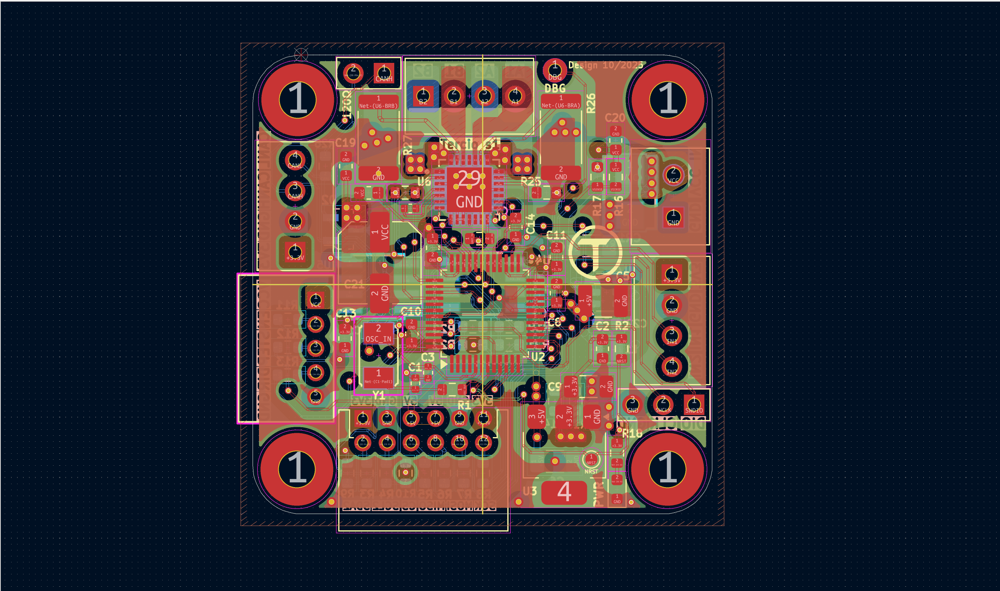
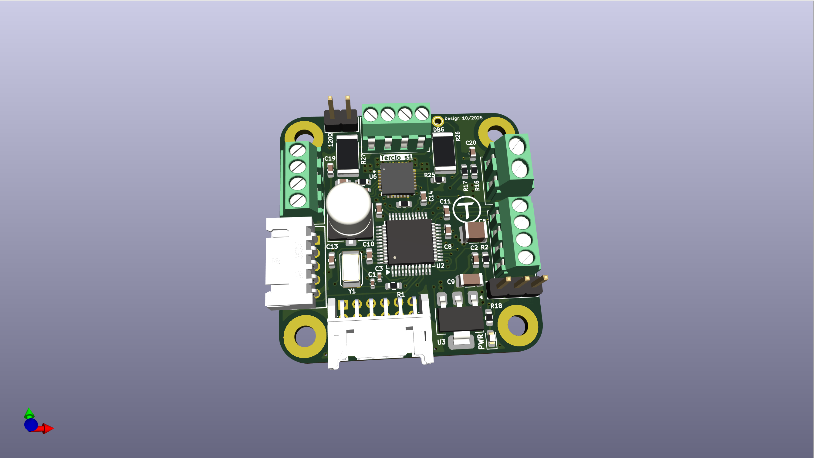
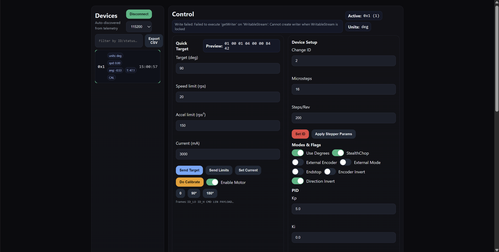
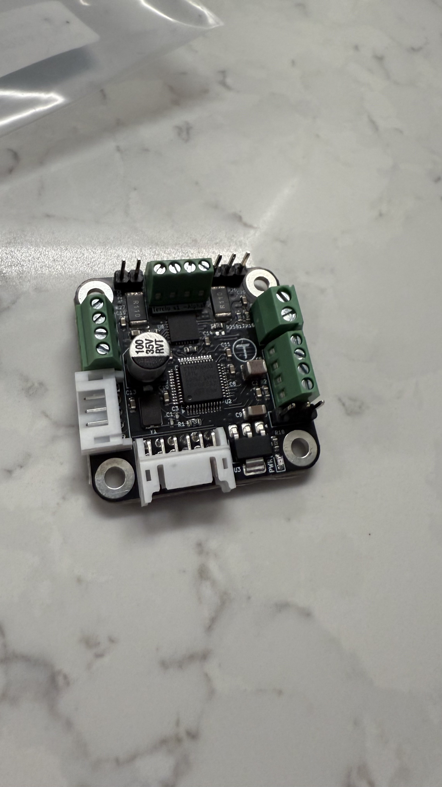

# ⚙️ Tercio-S1 — Smart Stepper Driver

A compact and high-performance **closed-loop stepper motor driver** developed by **Tercio Labs**, built for robotics and automation.  
Designed around an **STM32G4 MCU** with **CAN-FD**, **encoder feedback**, and **STEP/DIR** input support — delivering precise motion control and real-time telemetry in a small form factor.

---

## 🖼️ Gallery

| PCB Layout | 3D Render | Web UI | Real Prototype |
|-------------|------------|--------|----------------|
|  |  |  |  |

> All hardware design files and visuals are included in this repository.

---

## 🔍 Overview

**Tercio-S1** is an all-in-one **closed-loop stepper control board** designed for:
- Robotics and precision motion systems  
- Research and education projects  
- Custom automation and mechatronic platforms  

The board integrates **CAN-FD communication**, **encoder input (SPI/I²C)**, and a **configurable step/dir interface**, allowing both standalone and networked control.

---

## 🧩 Key Features

- **Microcontroller:** STM32G431CBT6  
- **Communication:** CAN-FD, UART  
- **Control Inputs:** STEP / DIR / EN (5V tolerant)  
- **Encoder Support:** I²C / SPI magnetic encoders  
- **Voltage Range:** 12–24 V  
- **Compact Size:** 45 × 50 mm  
- **Finish:** ENIG, 2-layer PCB  

---

## 🌐 Web UI Preview

The companion **Web UI** allows real-time monitoring, configuration, and tuning over CAN-FD or USB.

---

## 🧠 Developed by

**Kerem Erol**  
*Founder — Tercio Labs*  
[LinkedIn](https://www.linkedin.com/in/kerem-erol-338713328) • [GitHub](https://github.com/Kerol-Dev)

---

### ⭐ Star this project to support open-source motion-control hardware!
